  

&nbsp;

&nbsp;

&nbsp;

---

## Active Projects

<table>
  <tr>
    <td width="50%" valign="top">
      
<strong><a href="https://github.com/hainguyen011/Aevum-OS">Aevum OS</a></strong>

      
Sovereign AI Multi-Agent Desktop Operating System

      

        Autonomous intelligence kernel for the desktop. Integrates Spiking Neural LIF dynamics,
        Model Context Protocol for tool-native AI execution, Ed25519 cryptographic hardware
        licensing, and an orchestrated Squad Agent system with multi-persona context switching.
      

      

        
        
        
        
        
      

    </td>
    <td width="50%" valign="top">
      
<strong><a href="https://github.com/hainguyen011/Aevum-cloud">Aevum Cloud / PiperNet</a></strong>

      
Decentralized P2P Agent Mesh and State Sync Layer

      

        Distributed infrastructure connecting autonomous local agent nodes through secure
        bidirectional cloud tunneling. Conflict-free distributed state via Merkle-CRDT,
        real-time agent routing on an event-driven pub/sub backbone.
      

      

        
        
        
        
        
      

    </td>
  </tr>
</table>

---

## Metrics

  
  &nbsp;
  
    
  

---

## 3D Contribution Graph

  <picture>
    <source media="(prefers-color-scheme: dark)"  srcset="https://raw.githubusercontent.com/hainguyen011/hainguyen011/output-3d-contrib/profile-night-rainbow.svg" />
    <source media="(prefers-color-scheme: light)" srcset="https://raw.githubusercontent.com/hainguyen011/hainguyen011/output-3d-contrib/profile-green.svg" />
    
  </picture>

---

  
    Engineered by <a href="https://github.com/hainguyen011"><strong>Hai Nguyen</strong></a>
    &mdash; Founder at <strong>I2FLabs</strong>
    &mdash; Creator of <strong>Aevum OS</strong> and <strong>PiperNet</strong>
  

