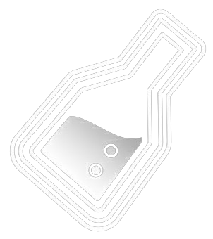

  <!-- I2FLABS LOGO -->
  

    

  <!-- 1. HERO MATRIX RAIN & IDENTITY -->
  

   

  <!-- 2. MATRIX COMMAND PROMPT TYPING -->
  

    

  <!-- 3. MONOCHROME MATRIX BADGES -->
  
  &nbsp;
  
  &nbsp;
  
  &nbsp;
  

    

  

 

## ACTIVE PROCESSES

<table>
  <tr>
    <td width="50%" valign="top">
      
<strong><a href="https://github.com/hainguyen011/Aevum-OS">AEVUM OS</a></strong> &nbsp; <code>[PID: 0x01 // KERNEL]</code>

      
Sovereign AI Multi-Agent Desktop Operating System

      

        Autonomous intelligence kernel for the desktop. Integrates Spiking Neural LIF
        dynamics for reactive cognition, Model Context Protocol for tool-native AI execution,
        Ed25519 cryptographic hardware licensing, and an orchestrated Squad Agent system
        with multi-persona context switching.
      

      

        
        
        
        
        
      

    </td>
    <td width="50%" valign="top">
      
<strong><a href="https://github.com/hainguyen011/Aevum-cloud">AEVUM CLOUD / PIPERNET</a></strong> &nbsp; <code>[PID: 0x02 // MESH]</code>

      
Decentralized P2P Agent Mesh and State Sync Layer

      

        Distributed infrastructure connecting autonomous local agent nodes through secure
        bidirectional cloud tunneling. Conflict-free distributed state via Merkle-CRDT
        algorithms, real-time agent routing on an event-driven pub/sub backbone.
      

      

        
        
        
        
        
      

    </td>
  </tr>
</table>

  <h2>LOADED MODULES</h2>

  

    <code>agentic</code> 
    
    &nbsp;
    
    &nbsp;
    
    &nbsp;
    
    &nbsp;
    
  

  

    <code>architecture</code> 
    
    &nbsp;
    
    &nbsp;
    
    &nbsp;
    
    &nbsp;
    
  

  

    <code>backend</code> 
    
    &nbsp;
    
    &nbsp;
    
    &nbsp;
    
    &nbsp;
    
    &nbsp;
    
  

  

    <code>client</code> 
    
    &nbsp;
    
    &nbsp;
    
    &nbsp;
    
  

  

    <code>infra</code> 
    
    &nbsp;
    
    &nbsp;
    
    &nbsp;
    
  

## 3D CONTRIBUTION TOPOLOGY

  <picture>
    <source media="(prefers-color-scheme: dark)"  srcset="https://raw.githubusercontent.com/hainguyen011/hainguyen011/output-3d-contrib/profile-night-rainbow.svg" />
    <source media="(prefers-color-scheme: light)" srcset="https://raw.githubusercontent.com/hainguyen011/hainguyen011/output-3d-contrib/profile-green.svg" />
    
  </picture>

  
    
  
    Engineered by <a href="https://github.com/hainguyen011"><strong>Hai Nguyen</strong></a>
    &mdash; Founder at <strong>I2FLabs</strong>
    &mdash; Creator of <strong>Aevum OS</strong> and <strong>PiperNet</strong>
  

