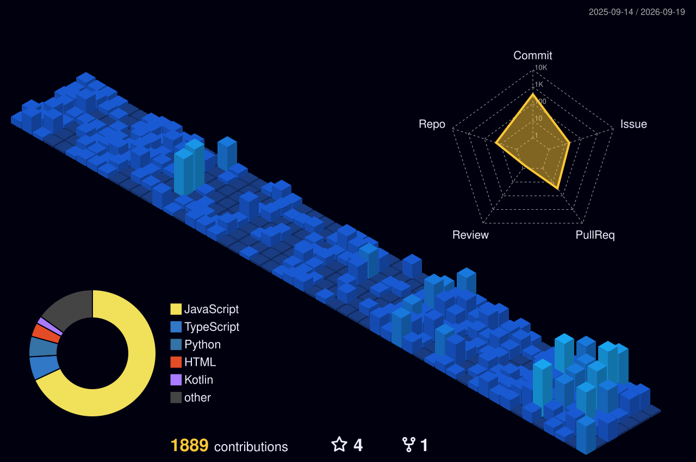

<div align="center">

  <!-- Holographic Terminal Header -->
  <a href="https://github.com/hainguyen011">
    
  </a>

  <!-- Animated Terminal Command -->
  <a href="https://github.com/hainguyen011">
    
  </a>

  <p align="center">
    
    
    
  </p>

</div>

---

### ⚡ THE MANIFESTO

```bash
$ cat << 'EOF' > /dev/mindset

"Most developers write code for demo day.
 I engineer autonomous ecosystems built to survive exponential entropy."
EOF
```

> **I don't just write algorithms — I build sovereign intelligence infrastructures.**  
> Chuyên môn của tôi là bóc tách sự hỗn loạn của các hệ thống phức tạp, tái định hình kiến trúc phân tán và xây dựng các nền tảng tự hành không thể sụp đổ khi quy mô bùng nổ.  
> Không quan tâm đến những dòng code vụn vặt — tôi tập trung vào **System Thinking**, **Local-First CRDTs**, **Spiking Neural Dynamics**, và **Autonomous Multi-Agent Operating Systems**.

---

### 🛸 BATTLESTATION: CORE ECOSYSTEM

```ascii
  ┌────────────────────────────────────────────────────────────────────────┐
  │                           I2FLABS ECOSYSTEM                            │
  └───────────────────┬────────────────────────────────┬───────────────────┘
                      │                                │
                      ▼                                ▼
       ┌──────────────────────────────┐ ┌──────────────────────────────┐
       │       🛸 AEVUM OS KERNEL     │ │     ☁️ AEVUM CLOUD & MESH    │
       │   Desktop Multi-Agent OS     │ │    Distributed CRDT Tunnel   │
       └──────────────────────────────┘ └──────────────────────────────┘
```

<table>
  <tr>
    <td width="50%" valign="top" style="background:#0a0a0a; border: 1px solid #27272a;">
      <h3 align="center">🛸 <a href="https://github.com/hainguyen011/Aevum-OS">AEVUM OS</a></h3>
      <p align="center"><em>Sovereign AI Multi-Agent Desktop Operating System</em></p>
      <p>Hệ điều hành trí tuệ nhân tạo thế hệ mới chạy cục bộ. Tích hợp nhân thức mạng nơ-ron xung (Spiking Neural LIF), chuẩn kết nối công cụ Model Context Protocol (MCP), xác thực phần cứng Ed25519 Cryptographic Fingerprint và điều phối Squad Agent đa nhân cách.</p>
      <p align="center">
        
        
      </p>
    </td>
    <td width="50%" valign="top" style="background:#0a0a0a; border: 1px solid #27272a;">
      <h3 align="center">☁️ <a href="https://github.com/hainguyen011/Aevum-cloud">AEVUM CLOUD & PIPERNET</a></h3>
      <p align="center"><em>Decentralized P2P Agent Mesh & State Sync</em></p>
      <p>Hạ tầng đám mây phân tán kết nối các nút Agent độc lập qua Cloud Tunneling bảo mật hai chiều. Đồng bộ hóa trạng thái P2P không xung đột nhờ thuật toán Merkle-CRDT và kiến trúc truyền thông thời gian thực.</p>
      <p align="center">
        
        
      </p>
    </td>
  </tr>
</table>

---

### 🛠️ ARCHITECTURAL RADAR & ARSENAL

```
┌── [🧠 AGENTIC INTELLIGENCE] ────────────┐  ┌── [🏛️ ARCHITECTURAL DISCIPLINES] ──────┐
│ • Model Context Protocol (Anthropic MCP) │  │ • Domain-Driven Design (DDD)           │
│ • Spiking Neural Dynamics (LIF Engine)  │  │ • Event-Driven Architecture (EDA)       │
│ • Autonomous Squad Coordination         │  │ • Local-First Merkle CRDT Sync         │
│ • Graph RAG (Neo4j) & Vector (Qdrant)   │  │ • Hexagonal & Clean Architecture        │
└──────────────────────────────────────────┘  └──────────────────────────────────────────┘
┌── [⚙️ DISTRIBUTED SYSTEMS & RUNTIME] ────┐  ┌── [🎨 CLIENT ENGINE & EXPERIENCE] ──────┐
│ • TypeScript (Strict) / Node.js 20+      │  │ • Electron Desktop Core Framework      │
│ • Fastify High-Performance Server        │  │ • React 19 (Concurrent / Hooks)        │
│ • Redis In-Memory State & PubSub         │  │ • Vite Next-Gen Frontend Tooling       │
│ • Docker / Kubernetes Containerization   │  │ • SCSS Design Tokens (Dark / Light)    │
└──────────────────────────────────────────┘  └──────────────────────────────────────────┘
```

<div align="center">


</div>

---

### 🌐 3D CONTRIBUTION TOPOLOGY

<div align="center">
  
</div>

---

### 📈 TELEMETRY & SYSTEM METRICS

<div align="center">
  
  
</div>

<br/>

<div align="center">
  
</div>

---

### 🎬 FOUNDER LOG

> *"In complex systems, perfection doesn't exist. Aim for the impossible and let relentless innovation lead the way."*

<p align="center">
  
</p>

<p align="center">
  <sub>Engineered with architectural obsession by <strong>Hai Nguyen</strong> • Founder at <a href="https://github.com/hainguyen011">I2FLabs</a></sub>
</p>
